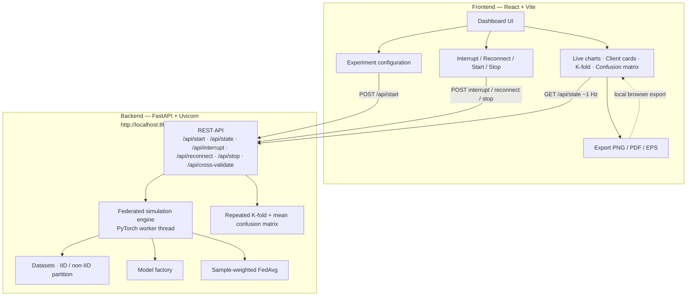
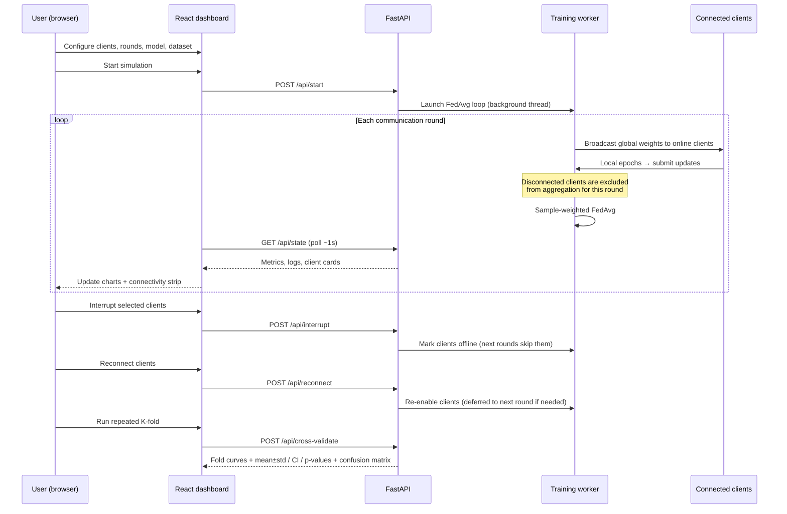
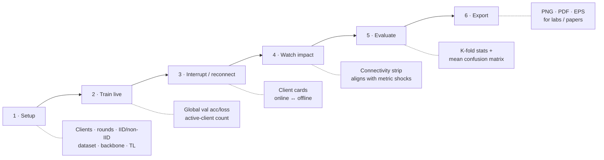

[](https://doi.org/10.5281/zenodo.20114236)
[](LICENSE.txt)
[](https://www.python.org/downloads/)
[](https://nodejs.org/)

# FLInterrupt

**Interactive federated learning simulator for client connectivity experiments**

**Version:** v1.0.0  
**License:** [MIT](LICENSE.txt)  
**Repository:** https://github.com/tudordavidz/FLInterrupt  
**Support:** tudor.david@student.upt.ro  

FLInterrupt is an open-source, browser-based federated learning (FL) simulator that makes **client connectivity** a first-class experimental factor. A FastAPI + PyTorch backend runs synchronous FedAvg rounds, while a React dashboard lets you configure datasets and models, **interrupt or reconnect clients while training is live**, and inspect global metrics, per-client participation, repeated K-fold validation, and mean confusion matrices.

It is designed for **education**, **classroom labs**, and **early-stage research prototyping**—where controlled participation experiments and exportable figures matter more than production-scale deployment.

---

## Table of contents

1. [Purpose](#purpose)
2. [Key features](#key-features)
3. [Architecture](#architecture)
4. [Interactive explanation](#interactive-explanation)
5. [Software metadata](#software-metadata)
6. [Prerequisites](#prerequisites)
7. [Installation](#installation)
8. [How to run](#how-to-run)
9. [Interactive usage guide](#interactive-usage-guide)
10. [API reference](#api-reference)
11. [Configuration](#configuration)
12. [Project layout](#project-layout)
13. [Reproducibility](#reproducibility)
14. [Troubleshooting](#troubleshooting)
15. [Authors and support](#authors-and-support)
16. [License](#license)

---

## Purpose

In federated learning, model quality depends not only on the aggregation rule, but also on **who participates in each communication round**. Clients may drop offline, reconnect later, hold non-IID data, or differ in capacity. Many classroom demos still assume every client is always available, which hides this systems effect.

**FLInterrupt solves that gap** by turning intermittent participation into an explicit, controllable experiment:

| Goal | How FLInterrupt helps |
|------|------------------------|
| Teach FedAvg under missing updates | Live Interrupt / Reconnect buttons on client cards |
| Attribute metric shocks to connectivity | Global curves + per-client connectivity strip on one timeline |
| Check robustness beyond one scalar | Repeated K-fold mean ± std, 95% CI, *p*-values |
| Inspect class-wise recovery | Mean confusion matrix over folds |
| Publish / grade labs | Export PNG, PDF, or EPS figures from the dashboard |

---

## Key features

- Synchronous, round-based FedAvg with transparent participation accounting
- Runtime **interrupt** and **reconnect** of selected clients during an active run
- Datasets: `cifar10`, `cifar100`, `mnist`, `fashionmnist`
- Data partitions: **IID** and **non-IID**
- Model backbones: ResNet, MobileNetV3, EfficientNet-B0, DenseNet121, ConvNeXt-Tiny, ViT-B/16, SqueezeNet, lightweight CNN
- Optional ImageNet transfer learning
- Live global validation accuracy/loss plots with connectivity strip
- Per-client cards (online/offline, participated/missed rounds, streaks, local metrics)
- Post-training repeated K-fold validation + mean confusion matrix
- Figure export: **PNG / PDF / EPS** (single-column manuscript friendly)
- Auto device selection: Apple **MPS** → NVIDIA **CUDA** → **CPU**

---

## Architecture

FLInterrupt is a **two-tier** application: a React/Vite dashboard (interaction + visualization) and a FastAPI/PyTorch service (authoritative simulation state + training worker).

### High-level system view



### Runtime data flow (one communication round)



### Source mapping

| Layer | Path | Responsibility |
|-------|------|----------------|
| API | `backend/app/main.py` | REST endpoints, Pydantic validation, CORS for `localhost:5173` |
| Engine | `backend/app/federated.py` | Training loop, interrupt/reconnect semantics, partitioning, FedAvg, evaluation |
| Models | `backend/app/model.py` | Backbone factory and classifier-head replacement |
| UI | `frontend/src/App.jsx` | Configuration, polling, controls, charts, exports |
| Styles | `frontend/src/App.css` | Dashboard layout |

**FedAvg update** (connected clients only):

```text
w_{t+1} = sum_{k in A_t} (n_k / sum_{j in A_t} n_j) * w_t^{(k)}
```

where `A_t` is the set of clients that submitted in round `t` and `n_k` is the local sample count. If no updates arrive, the global model is unchanged and the empty round is logged.

---

## Interactive explanation

Use this mental model when demonstrating FLInterrupt live:



### What “interactive” means in practice

1. **You own participation.** Unlike batch scripts, you decide *during* the run which clients stay in the aggregation set `A_t`.
2. **Feedback is immediate.** Charts and client cards refresh about once per second from `/api/state`.
3. **Cause and effect stay linked.** The connectivity strip under the round axis aligns red/green client states with accuracy/loss spikes.
4. **Post-hoc checks are built in.** After training, freeze the global model and run repeated K-fold + confusion matrix without leaving the browser.
5. **Figures leave the browser.** Export publication-ready PNG/PDF/EPS for lab reports or manuscripts.

### Suggested classroom drill (≈ 90 minutes)

1. **Baseline:** IID CIFAR-10, all clients connected → export global evolution.
2. **Shock:** Interrupt ~50% of clients for several consecutive rounds → observe accuracy/loss drop.
3. **Recovery:** Reconnect → quantify how quickly curves recover.
4. **Heterogeneity:** Repeat under non-IID → compare mean confusion matrices.
5. **Write-up:** Report K-fold mean ± std with 95% CI and *p*-values.

---

## Software metadata

Aligned with the SoftwareX code/software metadata tables:

| Field | Value |
|-------|--------|
| Current code version | **v1.0.0** |
| Permanent repository | https://github.com/tudordavidz/FLInterrupt |
| Legal license | **MIT** ([`LICENSE.txt`](LICENSE.txt)) |
| Versioning | git |
| Languages / tools | Python 3, FastAPI, Uvicorn, PyTorch, torchvision, NumPy; JavaScript, React 18, Vite |
| Platforms | macOS, Linux, Windows |
| Documentation | this README |
| Releases | https://github.com/tudordavidz/FLInterrupt/releases |
| Support email | tudor.david@student.upt.ro |
| DOI (Zenodo) | https://doi.org/10.5281/zenodo.20114236 |

---

## Prerequisites

Install on your machine:

- **Python 3.10+** and `pip`
- **Node.js 18+** and `npm`

Optional:

- GPU acceleration (Apple **MPS** or NVIDIA **CUDA**). If unavailable, training runs on **CPU**.

Network (first run):

- Benchmark datasets via `torchvision.datasets` (cached under `backend/data/`)
- Optional ImageNet pretrained weights when transfer learning is enabled

---

## Installation

```bash
git clone https://github.com/tudordavidz/FLInterrupt.git
cd FLInterrupt
```

### Backend

```bash
cd backend
python3 -m venv .venv
source .venv/bin/activate          # Windows: .venv\Scripts\activate
pip install --upgrade pip
pip install -r requirements.txt
```

### Frontend

```bash
cd frontend
npm install
```

---

## How to run

Use **two terminals**.

### Terminal 1 — backend API

```bash
cd backend
source .venv/bin/activate
uvicorn app.main:app --reload --port 8000
```

Health check:

```bash
curl http://localhost:8000/health
```

Expected: `{"status":"ok"}`  

Interactive API docs: http://localhost:8000/docs  

### Terminal 2 — dashboard

```bash
cd frontend
npm run dev
```

Open the UI: **http://localhost:5173**

---

## Interactive usage guide

### Step-by-step in the dashboard

1. **Configure** the left panel: clients, rounds, local epochs, samples per client, batch size, learning rate, seed, dataset, IID/non-IID, model, transfer learning.
2. Click **Start** to launch the FedAvg worker.
3. Watch **global validation accuracy/loss** and the **connectivity strip** update each round.
4. On any client card, click **Interrupt** to remove that client from subsequent aggregations; click **Reconnect** to bring it back (same-round reconnects are deferred to the next round for unambiguous semantics).
5. Optionally **Stop** the run.
6. After training, run **repeated K-fold** cross-validation on the *frozen* global model; inspect fold curves and the statistical summary (mean ± std, 95% CI, *p*-values).
7. Open the **mean confusion matrix** for class-level interpretation.
8. **Export** charts as PNG, PDF, or EPS for reports and papers.

### Typical research comparison protocol

Keep architecture and data settings fixed; vary only connectivity:

1. Baseline (all online)
2. Moderate interrupts with reconnects
3. Aggressive interrupts (including near-empty rounds)

Compare exported figures side by side so differences are attributable to participation.

---

## API reference

| Method | Endpoint | Description |
|--------|----------|-------------|
| `GET` | `/health` | Service health |
| `GET` | `/api/state` | Full simulation state (config, round, logs, history, clients, options) |
| `POST` | `/api/start` | Start a new simulation with JSON config |
| `POST` | `/api/stop` | Request graceful stop |
| `POST` | `/api/interrupt` | Interrupt selected clients (or a random subset by count) |
| `POST` | `/api/reconnect` | Reconnect selected disconnected clients (or all) |
| `POST` | `/api/cross-validate` | Repeated K-fold evaluation of current global weights |

Open http://localhost:8000/docs for live Swagger documentation.

---

## Configuration

### Training

| Parameter | Meaning |
|-----------|---------|
| `num_clients`, `rounds`, `local_epochs` | Federation size and local work |
| `samples_per_client`, `batch_size`, `lr`, `seed` | Data budget and optimization |
| `dataset_name` | `cifar10` \| `cifar100` \| `mnist` \| `fashionmnist` |
| `data_distribution` | `iid` \| `non_iid` |
| `model_name` | Backbone architecture |
| `transfer_learning` | Use ImageNet-pretrained weights when available |

### Cross-validation

| Parameter | Meaning |
|-----------|---------|
| `repeats`, `k_folds` | Repeated K-fold schedule |
| `max_samples` | Cap on evaluation subsample size |

---

## Project layout

```text
FLInterrupt/
├── LICENSE.txt              # MIT license (SoftwareX-required name)
├── README.md                # This documentation
├── backend/
│   ├── app/
│   │   ├── main.py          # FastAPI REST API
│   │   ├── federated.py     # FedAvg engine + evaluation
│   │   └── model.py         # Model factory
│   └── requirements.txt
└── frontend/
    ├── src/
    │   ├── App.jsx          # Dashboard UI
    │   ├── App.css
    │   └── main.jsx
    └── package.json
```

---

## Reproducibility

To reproduce a typical illustrative session:

1. Start backend and frontend as above.
2. Use fixed seed (e.g. `42`), documented client/round counts, dataset, partition mode, and model.
3. Apply a recorded interrupt/reconnect schedule during the run.
4. Export global evolution, K-fold summary, and confusion matrix.
5. Archive exported figures with the config values used.

No proprietary data are required. Benchmarks are downloaded automatically through `torchvision.datasets`.

---

## Troubleshooting

| Symptom | Fix |
|---------|-----|
| Frontend: “Cannot reach backend” | Ensure uvicorn is on port **8000**; check http://localhost:8000/health |
| Port already in use | Run backend on another port and update `API_BASE` in `frontend/src/App.jsx` |
| First run is slow | Datasets and optional pretrained weights are downloading |
| Cross-validation config mismatch | Train first with the same dataset / model / transfer-learning settings |
| Low GPU utilization | Confirm MPS/CUDA availability; otherwise CPU is used automatically |

---

## Authors and support

- **Tudor-Mihai David** (corresponding) — tudor.david@student.upt.ro  
- **Mihai Udrescu** — mihai.udrescu@cs.upt.ro  

Computer and Information Technology Department, Politehnica University of Timisoara, Romania.

Issues and questions: open a GitHub issue or email the corresponding author.

---

## License

FLInterrupt is released under the **MIT License**. See [`LICENSE.txt`](LICENSE.txt).
