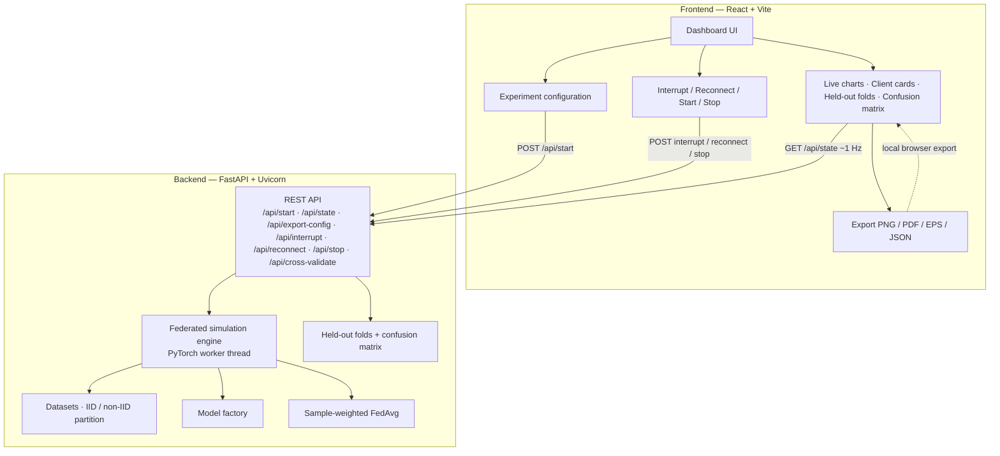
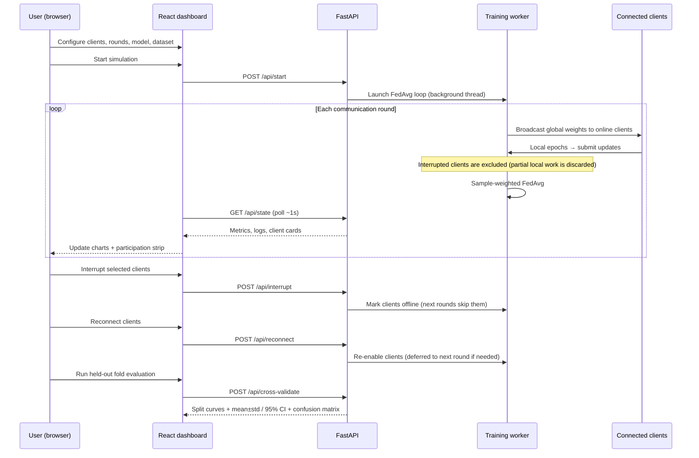
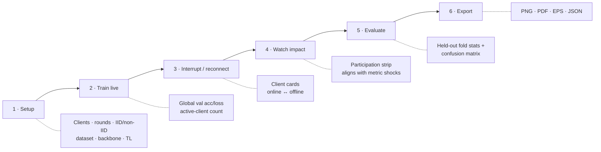

[](https://doi.org/10.5281/zenodo.22767435)
[](LICENSE.txt)
[](https://www.python.org/downloads/)
[](https://nodejs.org/)

# FLInterrupt

**Interactive federated learning simulator for client interruption experiments**

**Version:** v1.1.0  
**License:** [MIT](LICENSE.txt)  
**Repository:** https://github.com/tudordavidz/FLInterrupt  
**Support:** tudor.david@student.upt.ro  

FLInterrupt is an open-source, browser-based federated learning (FL) simulator that makes **client interruption (availability)** a first-class experimental factor. A FastAPI + PyTorch backend runs synchronous FedAvg rounds, while a React dashboard lets you configure datasets and models, **interrupt or reconnect clients while training is live**, replay a JSON interruption schedule, and inspect global metrics, a participation strip, client cards, held-out fold evaluation of the frozen global model, and class-wise diagnostics.

It is designed for **research prototyping**—where controlled interruption experiments and exportable figures/JSON matter more than production-scale deployment. It is not a classroom product and not a general tabular or language-model FL platform.

---

## Table of contents

1. [Purpose](#purpose)
2. [Key features](#key-features)
3. [Architecture](#architecture)
4. [Interactive explanation](#interactive-explanation)
5. [Software metadata](#software-metadata)
6. [Prerequisites](#prerequisites)
7. [Installation](#installation)
8. [How to run](#how-to-run)
9. [Interactive usage guide](#interactive-usage-guide)
10. [API reference](#api-reference)
11. [Configuration](#configuration)
12. [Project layout](#project-layout)
13. [Reproducibility](#reproducibility)
14. [Troubleshooting](#troubleshooting)
15. [Authors and support](#authors-and-support)
16. [License](#license)

---

## Purpose

In federated learning, model quality depends not only on the aggregation rule, but also on **who participates in each communication round**. Clients may drop offline, reconnect later, hold non-IID data, or differ in capacity. Many simulators still assume every client is always available, which hides this systems effect.

**FLInterrupt solves that gap** by turning involuntary unavailability into an explicit, controllable experiment:

| Goal | How FLInterrupt helps |
|------|------------------------|
| Run FedAvg under missing updates | Live Interrupt / Reconnect on client cards, plus JSON schedule replay |
| Attribute metric shocks to interruption | Global curves + participation strip on one timeline; compare to an all-connected control |
| Check robustness beyond one scalar | Repeated held-out fold mean ± std and 95% CI of the frozen global model (no p-values) |
| Inspect class-wise recovery | Mean or row-normalized confusion matrix and per-class P/R/F1 |
| Publish experiments | Export PNG/PDF/EPS figures and experiment JSON |

---

## Key features

- Synchronous, round-based FedAvg with transparent participation accounting
- Runtime **interrupt** and **reconnect** of selected clients during an active run
- Replayable JSON **interruption schedules** (e.g. client 3 offline during rounds 8–12)
- Experiment **JSON export** (config, seed, partition, interruption history)
- Interrupted clients do not submit; partial local work is discarded; empty rounds hold `w_t`
- Datasets: `cifar10`, `cifar100`, `mnist`, `fashionmnist` (image-classification benchmarks)
- Data partitions: **IID** and **non-IID**
- Model backbones: ResNet-18/34/50, MobileNetV3-Small, EfficientNet-B0, DenseNet121, ConvNeXt-Tiny, ViT-B/16, SqueezeNet, lightweight CNN
- Optional ImageNet transfer learning (inputs resized to 224×224)
- Live global validation accuracy/loss plots with a **participation strip**
- Per-client cards (online/offline, participated/missed rounds, streaks, local metrics)
- Post-training **repeated held-out fold evaluation** (frozen model, no retraining) + row-normalized confusion matrix
- Figure export: **PNG / PDF / EPS**; config export: **JSON**
- Docker Compose two-tier layout; unit tests for schedule windows, empty-round hold, and class metrics
- Auto device selection: Apple **MPS** → NVIDIA **CUDA** → **CPU**

---

## Architecture

FLInterrupt is a **two-tier** application: a React/Vite dashboard (interaction + visualization) and a FastAPI/PyTorch service (authoritative simulation state + training worker).

### High-level system view


```mermaid
flowchart TB
  subgraph Frontend["Frontend — React + Vite"]
    UI["Dashboard UI"]
    CFG["Experiment configuration"]
    CTRL["Interrupt / Reconnect / Start / Stop"]
    VIZ["Live charts · Client cards · Held-out folds · Confusion matrix"]
    EXP["Export PNG / PDF / EPS / JSON"]
  end

  subgraph Backend["Backend — FastAPI + Uvicorn"]
    API["REST API<br/>/api/start · /api/state · /api/export-config · /api/interrupt · /api/reconnect · /api/stop · /api/cross-validate"]
    ENG["Federated simulation engine<br/>PyTorch worker thread"]
    DATA["Datasets · IID / non-IID partition"]
    MODEL["Model factory"]
    AGG["Sample-weighted FedAvg"]
    EVAL["Held-out folds + confusion matrix"]
  end

  UI --> CFG
  UI --> CTRL
  UI --> VIZ
  VIZ --> EXP

  CFG -->|"POST /api/start"| API
  CTRL -->|"POST interrupt / reconnect / stop"| API
  VIZ -->|"GET /api/state ~1 Hz"| API
  EXP -.->|"local browser export"| VIZ

  API --> ENG
  ENG --> DATA
  ENG --> MODEL
  ENG --> AGG
  API --> EVAL
```

### Runtime data flow (one communication round)


```mermaid
sequenceDiagram
  participant User as User (browser)
  participant FE as React dashboard
  participant API as FastAPI
  participant W as Training worker
  participant C as Connected clients

  User->>FE: Configure clients, rounds, model, dataset
  User->>FE: Start simulation
  FE->>API: POST /api/start
  API->>W: Launch FedAvg loop (background thread)

  loop Each communication round
    W->>C: Broadcast global weights to online clients
    C->>W: Local epochs → submit updates
    Note over W: Interrupted clients are excluded (partial local work is discarded)
    W->>W: Sample-weighted FedAvg
    FE->>API: GET /api/state (poll ~1s)
    API-->>FE: Metrics, logs, client cards
    FE-->>User: Update charts + participation strip
  end

  User->>FE: Interrupt selected clients
  FE->>API: POST /api/interrupt
  API->>W: Mark clients offline (next rounds skip them)

  User->>FE: Reconnect clients
  FE->>API: POST /api/reconnect
  API->>W: Re-enable clients (deferred to next round if needed)

  User->>FE: Run held-out fold evaluation
  FE->>API: POST /api/cross-validate
  API-->>FE: Split curves + mean±std / 95% CI + confusion matrix
```

### Source mapping

| Layer | Path | Responsibility |
|-------|------|----------------|
| API | `backend/app/main.py` | REST endpoints, Pydantic validation, CORS for `localhost:5173` |
| Engine | `backend/app/federated.py` | Training loop, interrupt/reconnect semantics, partitioning, FedAvg, evaluation |
| Availability | `backend/app/availability.py` | Schedule windows, empty-round helpers, class metrics |
| Models | `backend/app/model.py` | Backbone factory and classifier-head replacement |
| UI | `frontend/src/App.jsx` | Configuration, polling, controls, charts, exports |
| Styles | `frontend/src/App.css` | Dashboard layout |

**FedAvg update** (connected clients only):

```text
w_{t+1} = sum_{k in A_t} (n_k / sum_{j in A_t} n_j) * w_t^{(k)}
```

where `A_t` is the set of clients that submitted in round `t` and `n_k` is the local sample count. If `A_t` is empty, `w_{t+1} = w_t` and the empty round is logged.

---

## Interactive explanation

Use this mental model when demonstrating FLInterrupt live:


```mermaid
flowchart LR
  A["1 · Setup"] --> B["2 · Train live"]
  B --> C["3 · Interrupt / reconnect"]
  C --> D["4 · Watch impact"]
  D --> E["5 · Evaluate"]
  E --> F["6 · Export"]

  A -.- A1["Clients · rounds · IID/non-IID<br/>dataset · backbone · TL"]
  B -.- B1["Global val acc/loss<br/>active-client count"]
  C -.- C1["Client cards<br/>online ↔ offline"]
  D -.- D1["Participation strip<br/>aligns with metric shocks"]
  E -.- E1["Held-out fold stats +<br/>confusion matrix"]
  F -.- F1["PNG · PDF · EPS · JSON"]
```

### What “interactive” means in practice

1. **You own participation.** Unlike batch scripts, you decide *during* the run which clients stay in the aggregation set `A_t`.
2. **Feedback is immediate.** Charts and client cards refresh about once per second from `/api/state`.
3. **Cause and effect stay linked.** The participation strip under the round axis aligns client availability with accuracy/loss shocks.
4. **Post-hoc checks are built in.** After training, freeze the global model and run held-out fold evaluation + confusion matrix without leaving the browser.
5. **Artifacts leave the browser.** Export publication-ready PNG/PDF/EPS and experiment JSON.

### Suggested research session

1. **Baseline:** IID CIFAR-10, all clients connected → export global evolution.
2. **Shock:** Replay a JSON schedule (or interrupt a subset of clients for several rounds) → observe accuracy/loss.
3. **Recovery:** Reconnect → quantify how quickly curves recover.
4. **Heterogeneity:** Repeat under non-IID.
5. **Write-up:** Report held-out fold mean ± std with 95% CI (no p-values) and export JSON.

---

## Software metadata

Aligned with the SoftwareX code/software metadata tables:

| Field | Value |
|-------|--------|
| Current code version | **v1.1.0** |
| Permanent repository | https://github.com/tudordavidz/FLInterrupt |
| Legal license | **MIT** ([`LICENSE.txt`](LICENSE.txt)) |
| Versioning | git |
| Languages / tools | Python 3, FastAPI, Uvicorn, PyTorch, torchvision, NumPy; JavaScript, React 18, Vite |
| Platforms | macOS, Linux, Windows |
| Documentation | this README |
| Releases | https://github.com/tudordavidz/FLInterrupt/releases |
| Support email | tudor.david@student.upt.ro |
| DOI (Zenodo) | https://doi.org/10.5281/zenodo.22767435 |

---

## Prerequisites

Install on your machine:

- **Python 3.10+** and `pip`
- **Node.js 18+** and `npm`

Optional:

- GPU acceleration (Apple **MPS** or NVIDIA **CUDA**). If unavailable, training runs on **CPU**.

Network (first run):

- Benchmark datasets via `torchvision.datasets` (cached under `backend/data/`)
- Optional ImageNet pretrained weights when transfer learning is enabled

---

## Installation

```bash
git clone https://github.com/tudordavidz/FLInterrupt.git
cd FLInterrupt
```

### Backend

```bash
cd backend
python3 -m venv .venv
source .venv/bin/activate          # Windows: .venv\Scripts\activate
pip install --upgrade pip
pip install -r requirements.txt
```

### Frontend

```bash
cd frontend
npm install
```

---

## How to run

Use **two terminals**.

### Terminal 1 — backend API

```bash
cd backend
source .venv/bin/activate
uvicorn app.main:app --reload --port 8000
```

Health check:

```bash
curl http://localhost:8000/health
```

Expected: `{"status":"ok"}`  

Interactive API docs: http://localhost:8000/docs  

### Terminal 2 — dashboard

```bash
cd frontend
npm run dev
```

Open the UI: **http://localhost:5173**

### Docker Compose

```bash
docker compose up --build
```

Backend: http://localhost:8000 · dashboard: http://localhost:5173

---

## Interactive usage guide

### Step-by-step in the dashboard

1. **Configure** the left panel: clients, rounds, local epochs, samples per client, batch size, learning rate, seed, dataset, IID/non-IID, model, transfer learning, optional JSON interruption schedule.
2. Click **Start** to launch the FedAvg worker.
3. Watch **global validation accuracy/loss** and the **participation strip** update each round.
4. On any client card, click **Interrupt** to remove that client from subsequent aggregations; click **Reconnect** to bring it back (same-round reconnects are deferred to the next round).
5. Optionally **Stop** the run.
6. After training, run **repeated held-out fold evaluation** on the *frozen* global model; inspect split curves and mean ± std with 95% CI (p-values are omitted).
7. Open the **confusion matrix** (mean counts or row-normalized) and per-class precision, recall, and F1.
8. **Export** charts as PNG, PDF, or EPS, and **Export JSON** for the experiment config and interruption history.

### Typical research comparison protocol

Keep architecture and data settings fixed; vary only availability:

1. All connected (control)
2. Moderate interrupts with reconnects (or a JSON window such as clients 3–5 offline in rounds 8–12)
3. Severe interrupts (including near-empty rounds)

Compare exported figures side by side so differences are attributable to participation. Overlay a control before attributing a dip to interruption.

---

## API reference

| Method | Endpoint | Description |
|--------|----------|-------------|
| `GET` | `/health` | Service health |
| `GET` | `/api/state` | Full simulation state (config, round, logs, history, clients, options) |
| `GET` | `/api/export-config` | Experiment config, seed, partition, interruption history |
| `POST` | `/api/start` | Start a new simulation with JSON config (`interruption_schedule` optional) |
| `POST` | `/api/stop` | Request graceful stop |
| `POST` | `/api/interrupt` | Interrupt selected clients (or a random subset by count) |
| `POST` | `/api/reconnect` | Reconnect selected disconnected clients (or all) |
| `POST` | `/api/cross-validate` | Held-out fold evaluation of current global weights |

Open http://localhost:8000/docs for live Swagger documentation.

---

## Configuration

### Training

| Parameter | Meaning |
|-----------|---------|
| `num_clients`, `rounds`, `local_epochs` | Federation size and local work |
| `samples_per_client`, `batch_size`, `lr`, `seed` | Data budget and optimization |
| `dataset_name` | `cifar10` \| `cifar100` \| `mnist` \| `fashionmnist` |
| `data_distribution` | `iid` \| `non_iid` |
| `model_name` | Backbone (e.g. `resnet18`, `mobilenet_v3_small`) |
| `transfer_learning` | Use ImageNet-pretrained weights when available |
| `interruption_schedule` | Optional list of `{client_id, offline_from, offline_to}` inclusive windows |

### Held-out fold evaluation

| Parameter | Meaning |
|-----------|---------|
| `repeats`, `k_folds` | Repeated splits of the frozen global model (not retraining) |
| `max_samples` | Cap on evaluation subsample size |

---

## Project layout

```text
FLInterrupt/
├── LICENSE.txt
├── README.md
├── Dockerfile
├── docker-compose.yml
├── backend/
│   ├── app/
│   │   ├── main.py
│   │   ├── federated.py
│   │   ├── availability.py
│   │   └── model.py
│   ├── tests/
│   └── requirements.txt
├── frontend/
│   ├── src/
│   │   ├── App.jsx
│   │   ├── App.css
│   │   └── main.jsx
│   └── package.json
├── scripts/
│   ├── run_revision_experiments.py
│   ├── plot_revision_figures.py
│   └── scalability_bench.py
└── paper/SoftwareX/
```

---

## Reproducibility

To reproduce a typical illustrative session:

1. Start backend and frontend as above.
2. Use fixed seed (e.g. `42`), documented client/round counts, dataset, partition mode, and model.
3. Apply a JSON interruption schedule (or live interrupt/reconnect).
4. Export global evolution, held-out fold summary, confusion matrix, and experiment JSON.
5. Archive exported figures with the config values used.

Paper 18-run grid: `PYTHONPATH=backend python scripts/run_revision_experiments.py` then `python scripts/plot_revision_figures.py`. Tests: `cd backend && PYTHONPATH=. python -m unittest tests.test_availability tests.test_fedavg -v`.

No proprietary data are required. Benchmarks are downloaded automatically through `torchvision.datasets`.

---

## Troubleshooting

| Symptom | Fix |
|---------|-----|
| Frontend: “Cannot reach backend” | Ensure uvicorn is on port **8000**; check http://localhost:8000/health |
| Port already in use | Run backend on another port and update `API_BASE` in `frontend/src/App.jsx` |
| First run is slow | Datasets and optional pretrained weights are downloading |
| Cross-validation config mismatch | Train first with the same dataset / model / transfer-learning settings |
| Low GPU utilization | Confirm MPS/CUDA availability; otherwise CPU is used automatically |

---

## Authors and support

- **Tudor-Mihai David** (corresponding) — tudor.david@student.upt.ro  
- **Mihai Udrescu** — mihai.udrescu@cs.upt.ro  

Computer and Information Technology Department, Politehnica University of Timisoara, Romania.

Issues and questions: open a GitHub issue or email the corresponding author.

---

## License

FLInterrupt is released under the **MIT License**. See [`LICENSE.txt`](LICENSE.txt).
